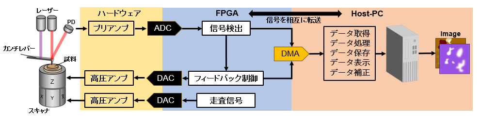
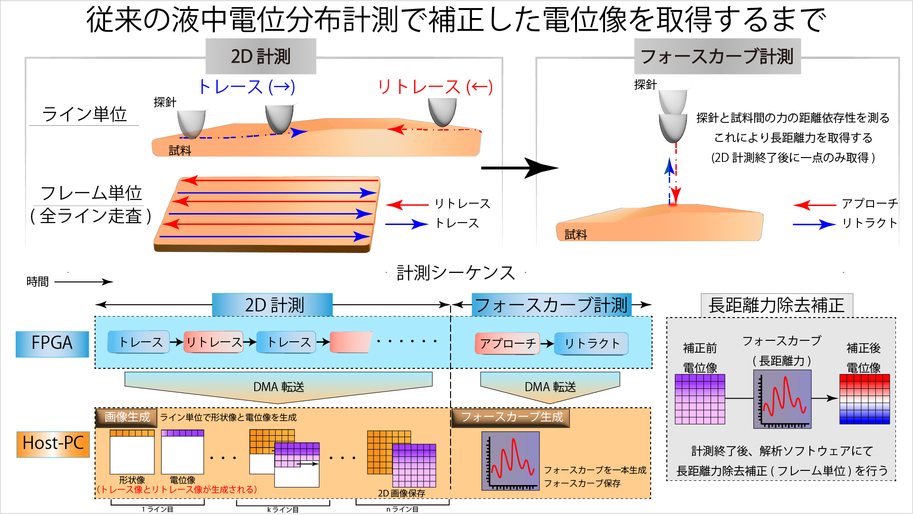
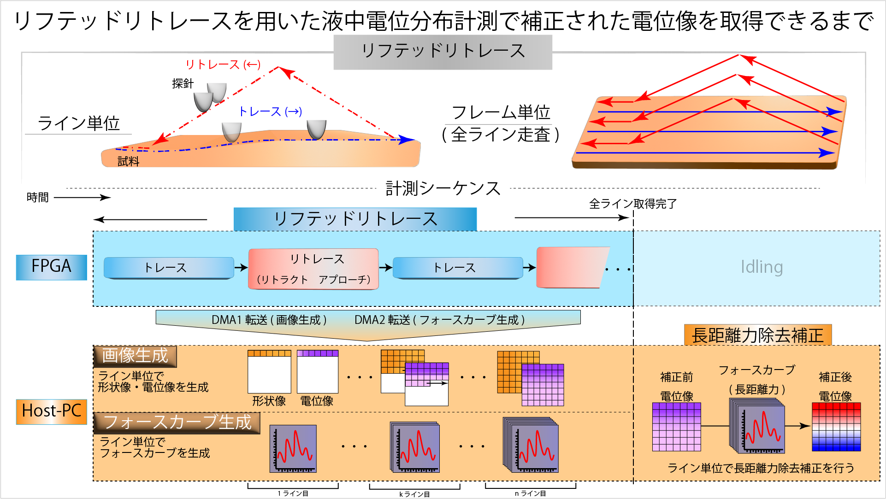

# 03_Measurement_Sequence_Design.md

## 1. 計測システムの全体構成

 
本研究で用いた計測システムは、ハードウェア部、FPGA部、Host-PC部の三層構造から構成されます。  
ハードウェアでは探針(カンチレバーの先端部)から得られた信号をアナログ処理し、ADCを介してFPGAへ入力します。  
FPGAはリアルタイム性が要求される、信号検出、フィードバック制御および走査信号の生成を担い、  
Host-PCでは画像データの生成、保存や表示、補正など計算量の大きい処理を実行する構成です。

---

## 2. 従来の計測手法

 
### 2.1 2D計測  
2D計測では試料表面をライン単位で走査し、形状像と電位分布像を取得します。  
#### FPGAの役割  
- トレース走査信号の生成
- リトレース走査信号の生成  
- 探針位置制御   
- 1系統DMA転送

をリアルタイムで実行します。

#### Host PCの役割  
- DMAで受信したデータから形状像・電位像をライン単位で逐次生成

  
### 2.2 フォースカーブ計測
2D計測で取得した電位像には長距離力成分が含まれています。  
この成分を定量化するため、2D計測終了後にフォースカーブ計測を行います。

#### FPGAの役割  
- アプローチ動作信号の生成
- リトラクト動作信号の生成
- 探針位置制御   
- 1系統DMA転送

をリアルタイムで実行します。

#### Host PCの役割  
- DMAで受信したデータからフォースカーブを生成

### 2.3 長距離力除去補正
計測終了後、解析ソフトウェア上で長距離力除去補正を行います。  
フォースカーブから長距離力成分を抽出し、
2D計測で取得した電位分布像に対してフレーム単位で補正を適用します。

#### FPGAの役割  
- なし  

#### Host PCの役割  
- なし

#### 解析ソフトウェアの役割

- 長距離力除去補正(フレーム単位)

これらにより、長距離力の影響をフレーム単位で除去した補正後電位像を取得します。  
しかし、時間変動する長距離力成分は考慮できていません。

---

## 3.今回開発した計測手法
 

### 3.1 リフテッドリトレース

リフテッドリトレース方式では、  

トレースでは従来通り、試料表面をなぞりながら形状像および電位分布像を取得します。  
一方、リトレースでは探針を所定の高さまでリフトし、  
試料表面との距離依存性を計測してフォースカーブを取得します。

#### FPGAの役割  

- 走査パターン信号の生成  
- 探針位置制御  
- 2系統DMA転送（画像用・フォースカーブ用）

をリアルタイムで実行します。 

#### Host PCの役割  

- DMA(画像生成用)で受信したデータから形状像・電位像をライン単位で逐次生成  
- DMA(フォースカーブ生成)で受信したデータからフォースカーブをライン単位で逐次生成
- 長距離力除去補正(ライン単位)

#### 解析ソフトウェアの役割

- 長距離力除去補正(Host PCで行った補正と同じ処理を後から行える)

これらにより、長距離力の影響をライン単位で除去した補正後電位像を取得します。  
よって、時間変動する長距離力成分を抑制することが可能です。

---
