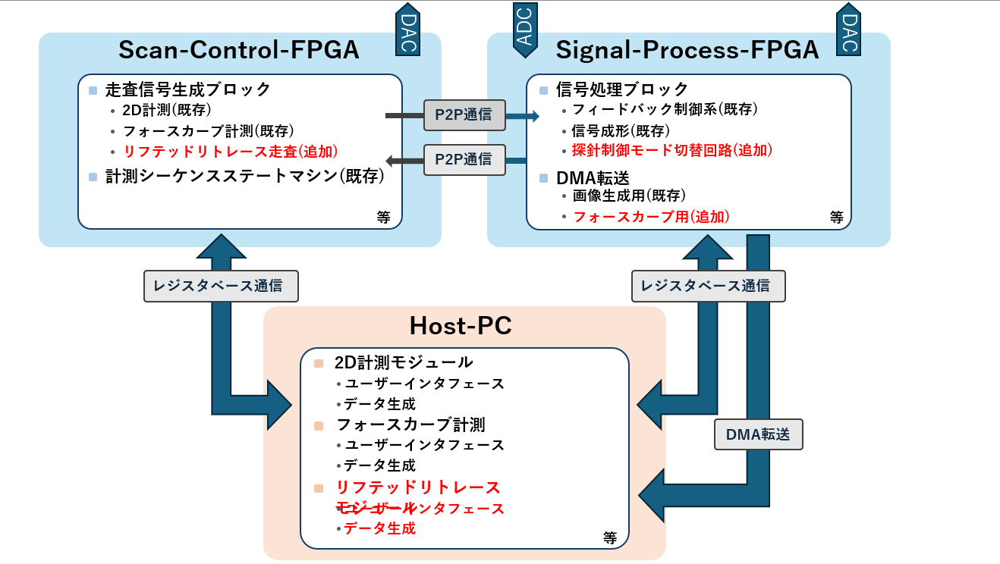

# 01_Architecture Overview

## 1. 本章の位置づけ

本章では、本システムにおける FPGA アーキテクチャの全体像を示します。

計測システム全体の構成および動作シーケンスについては  
`01_System_Design` にて説明しています。

本章ではそれを前提とし、FPGA がどのような機能を担っているかに焦点を当てます。

---

## 2. FPGA 全体構成

本システムでは、2 つの FPGA を用いて構成されています。

- **Scan-Control-FPGA**
- **Signal-Process-FPGA**

両 FPGA は P2P 通信で接続され、それぞれ異なる役割を担っています。

---

## 3. Scan-Control-FPGA の役割

Scan-Control-FPGA は、探針の走査制御を担う FPGA です。

主な機能は以下の通りです。

- 2D計測走査信号生成
- フォースカーブ動作信号生成
- リフテッドリトレース走査信号生成
- 計測シーケンス管理

本 FPGA は、

> 探針をどのように動作させるかを決定する制御系ブロック

として機能します。

---

## 4. Signal-Process-FPGA の役割

Signal-Process-FPGA は、信号処理および状態判定を担う FPGA です。

主な機能は以下の通りです。

- フィードバック制御
- 信号整形処理
- 探針制御モード切替判定
- 計測データの DMA 転送

本 FPGA は、

> 計測信号の状態を判断し、必要な処理を行う信号処理系ブロック

として機能します。

---

## 5. 後続章との関係

本章では FPGA の役割分担のみを示しました。

詳細な設計内容については、以下でそれぞれ説明します。

- `02_Scan_Control_FPGA`
- `03_Signal_Control_FPGA`
