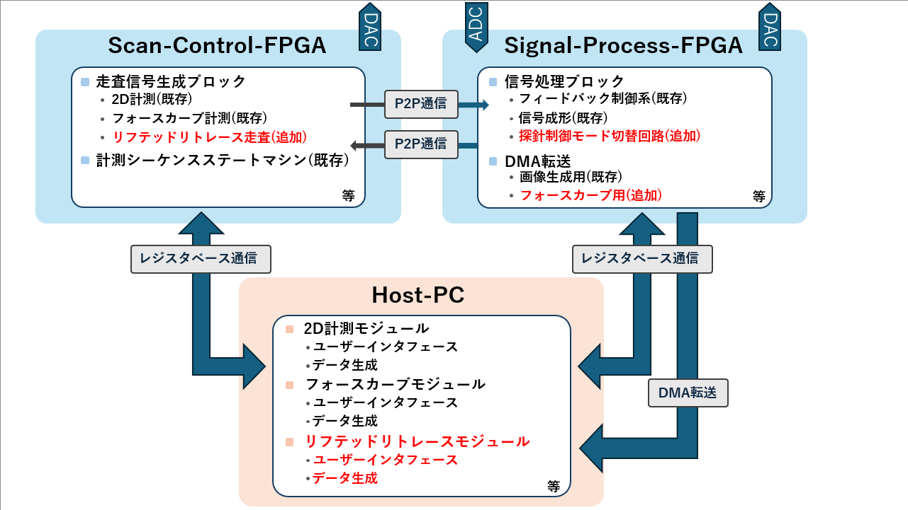

# 01_Architecture Overview

## 0. 本章の位置づけ

本章では、01_System_Design で定義した
リフテッドリトレース方式を実現するための
評価システム設計について説明します。

具体的には、FPGAおよびHost PCを用いて
どのように各機能を構成し、
リフテッドリトレース方式を実装したのかを示します。

---

## 1. FPGAおよびHost-PCの全体構成

本評価システムは、以下の3要素から構成されます。

- Scan-Control-FPGA
- Signal-Process-FPGA
- Host PC

各構成要素は明確に役割分担されており、
リアルタイム制御系（FPGA）と、
設定・取得・解析系（Host PC）に分離されています。

  

---

## 3. Scan-Control-FPGA の役割

Scan-Control-FPGA は、探針の走査制御を担う FPGA です。

主な機能は以下の通りです。

- 2D計測走査信号生成
- フォースカーブ動作信号生成
- リフテッドリトレース走査信号生成
- 計測シーケンス管理

本 FPGA は、

> 探針をどのように動作させるかを決定する制御系ブロック

として機能します。

---

## 4. Signal-Process-FPGA の役割

Signal-Process-FPGA は、信号処理および状態判定を担う FPGA です。

主な機能は以下の通りです。

- フィードバック制御
- 信号整形処理
- 探針制御モード切替判定
- 計測データの DMA 転送

本 FPGA は、

> 計測信号の状態を判断し、必要な処理を行う信号処理系ブロック

として機能します。

---

## 5. Host-PC の役割

Host-PC は、ユーザーインタフェースおよびデータ生成を担います。

主な機能は以下の通りです。

- 計測モードおよび走査条件の設定
- FPGA へのパラメータ書き込み
- DMA データの取得
- 計測データの表示および保存
- 長距離力除去補正処理

本 Host-PC は、

> 計測条件を定義し、取得データを処理・表示・保存を行うモジュール

として機能します。

---
