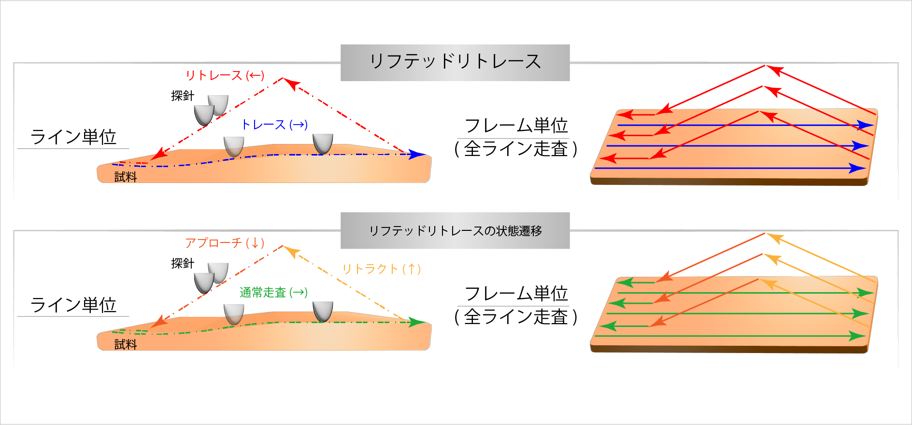
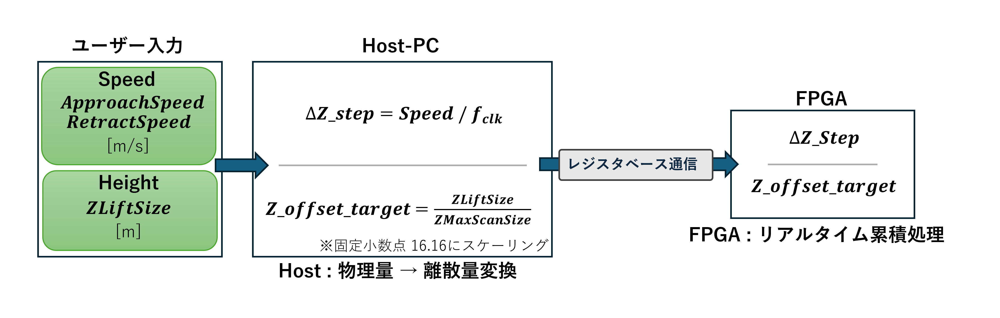
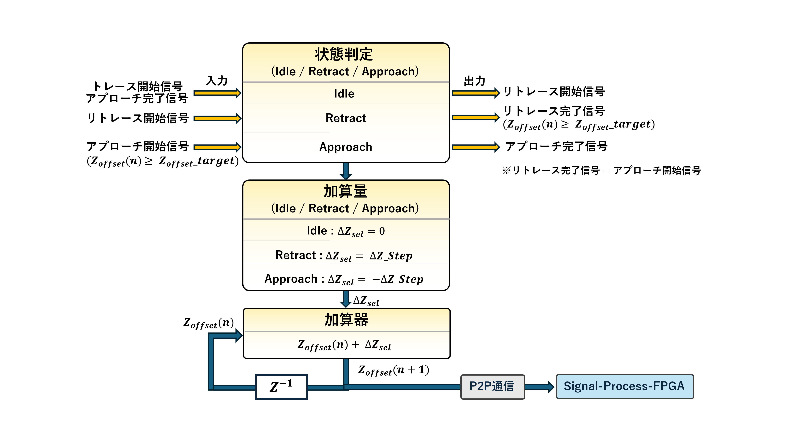
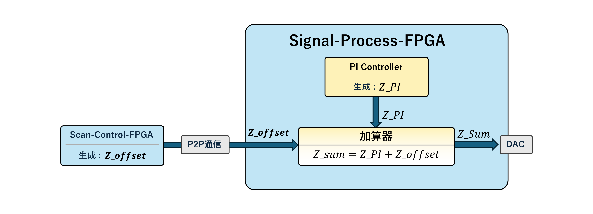

# 01_Lifted_Retrace_Scan

## 1. 概要

本章では、リフテッドリトレース方式を実現するための走査回路の設計について説明します。

具体的には以下を説明します。

1. リフテッドリトレース方式の状態遷移
2. Z方向制御タイミング
3. Host–FPGA間パラメータ生成
4. Z_offset生成ロジック
5. FPGA間Z信号合成構造

---

## 2. リフテッドリトレース走査の動作概要

リフテッドリトレース走査では、

- トレース（→）: 試料表面を追従する通常走査
- リトレース（←）: 探針を持ち上げた状態で逆方向走査

を1ラインごとに実行します。
フレーム全体では、全ラインに対してこの動作を繰り返します。  

この走査を実現するために、コントローラ内部では、走査の状態を以下の３つに定義しました。

- 通常走査 : 試料表面を追従する通常走査状態
- リトラクト : 探針を持ち上げる走査状態
- アプローチ : 探針を降ろす走査状態

つまり、外部から見た「トレース/リトレース」という走査を、  
内部では「通常走査/リトラクト/アプローチ」という制御状態として実装しています。

---

## 3. Z方向位置制御タイミング

Z方向の制御信号は以下の3つで構成されています。

- `Z_PI`（Signal-Process-FPGAで生成）
- `Z_offset`（Scan-Control-FPGAで生成）
- `Z_sum = Z_PI + Z_offset`

### 状態遷移

### 各状態の動作

| 状態 | 動作 |
|------|------|
| 通常走査 | PI制御有効 |
| リトラクト | PI制御保持、Z_offset加算 |
| アプローチ | PI制御保持、Z_offset減算 |

### 重要設計ポイント

- リトラクトおよびアプローチ中はPI制御を保持状態にする
- アプローチ完了時にPI制御を再有効化する  

PI再開時の過渡応答抑制処理については
「03_Probe_Control_Mode_Switching」にて詳述します。

---

## 4. Host–FPGA間パラメータ生成

ユーザは以下のパラメータを設定します。

- ApproachSpeed
- RetractSpeed
- ZLiftSize

Host-PCではユーザが指定したパラメータを基に物理量を離散量へ変換します。

### 変換式

- 固定小数点16.16形式へスケーリング
- レジスタ通信によりFPGAへ転送

Hostは「物理量 → 離散量変換」を担当し、  
FPGAはリアルタイムで累積処理を行うことでZ_offsetを演算します。

---

## 5. Z_offset生成ロジック

Z_offsetは状態に応じて加算量を切り替える累積回路として実装しました。

### 更新式

### ΔZ_selの状態依存切替

| 状態 | ΔZ_sel |
|------|--------|
| Idle (通常走査) | 0 |
| Retract (リトラクト) | +ΔZ_step |
| Approach (アプローチ) | -ΔZ_step |

### 遷移条件

- Retract終了：`Z_offset ≥ Z_offset_target`
- Approach終了：`Approach_done`（P2P信号）

数値条件とイベント信号を併用する設計としました。

---

## 6. FPGA間Z信号合成構造

Z信号は2つのFPGAによって構成されており、以下のように役割分担されています。

### Scan-Control-FPGA

- Z_offset生成

### Signal-Process-FPGA

- PI制御（Z_PI生成）
- 加算器
- DAC出力

### 合成式

Z_offsetはP2P通信によりSignal-Process-FPGAへ転送される。

この分散構造により、

- 走査制御系
- 信号処理系

を分離したアーキテクチャを実現しています。

---

## 7. まとめ

本リフテッドリトレース走査は、既存のコントローラ構造を活かしながら実装しています。

本システムは、

- Host-PC
- Scan-Control-FPGA
- Signal-Process-FPGA

の役割分担が明確に定義されています。

本機能追加においても、

- Hostはパラメータ生成
- Scan-Control-FPGAは走査制御およびZ_offset生成
- Signal-Process-FPGAはPI制御および信号処理

という既存の責務を維持したまま拡張を行いました。

その結果、大規模な構造変更を伴わず、
比較的単純な累積回路と状態制御の追加のみで
リフテッドリトレース走査を実現することができました。

実際に後輩や指導教員が設計を確認しやすい構造となっており、
人を想定した設計を意識して実装することが出来たと思っています。
