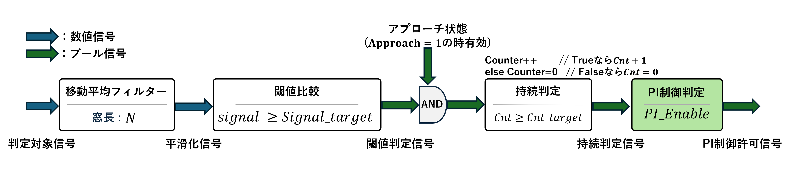
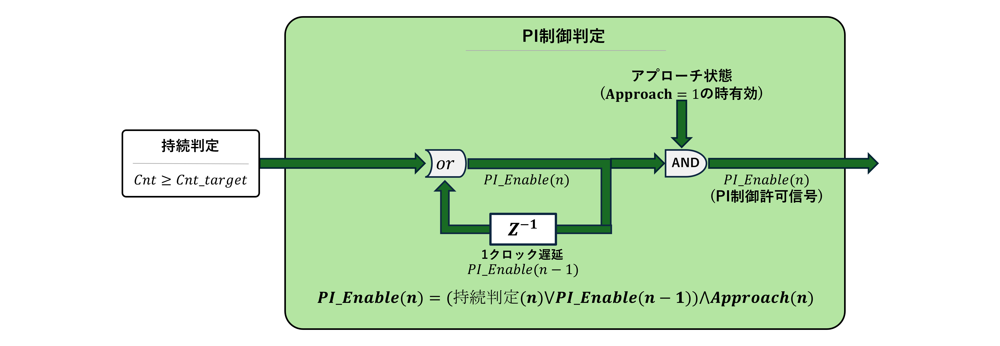
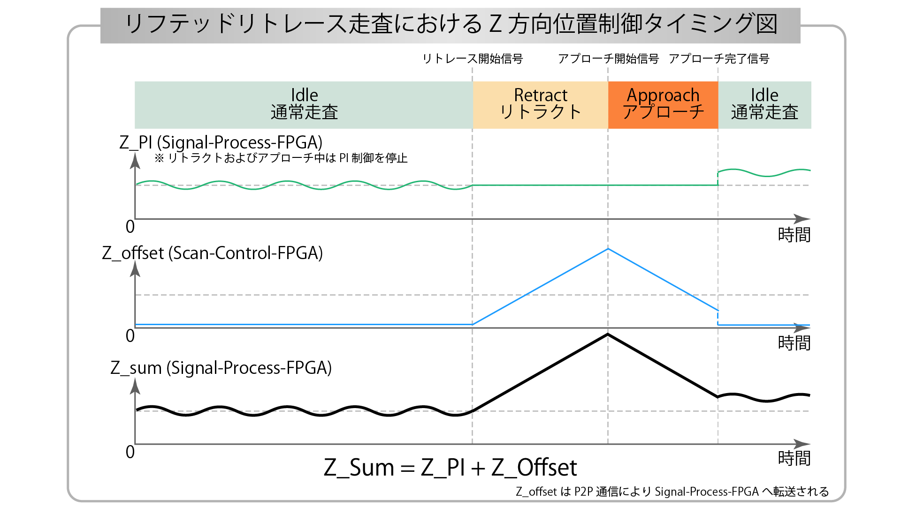
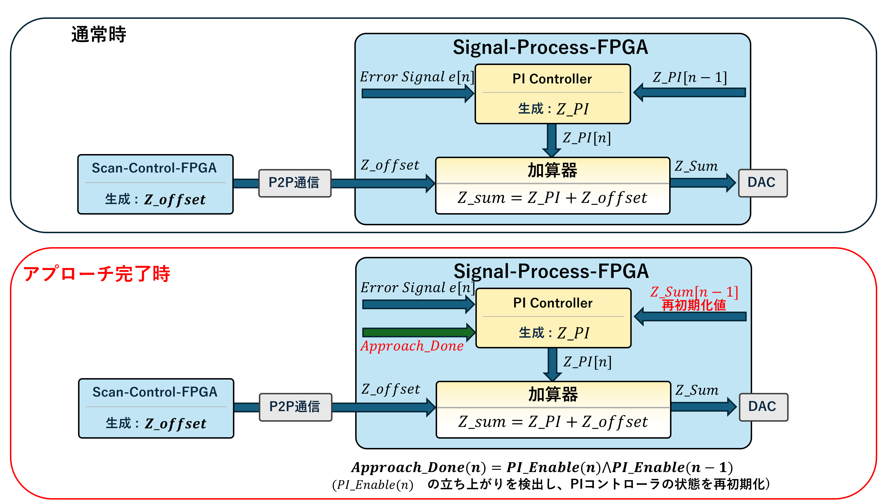

# 01_Probe_Control_Mode_Switching.md

## 1. 概要

本章ではアプローチ完了時の処理にひつような探針制御モード切替回路の設計について説明します。

リフテッドリトレース走査では、リトラクトおよびアプローチ中にPI制御を停止し、アプローチ完了後にPI制御を再開する必要があります。

しかし、単純にPI制御を再開すると、リトラクトおよびアプローチ中に変化したZ_offsetとの整合が崩れ、PI制御出力が急変する可能性があります。これにより、探針が試料表面に衝突したり、ピエゾアクチュエータに過大な変位が生じる危険があります。

そこで本研究では、アプローチ完了を安定に判定し、PI制御を安全に再開するための回路を設計しました。

本回路は以下の3つの機能により構成されています。

1. アプローチ完了判定回路  
2. PI制御許可信号の自己保持構造  
3. PI制御再開時の内部状態整合機構  

の3段構成により、安全かつ安定した通常走査の再開を実現しております。

---

## 2. アプローチ完了判定回路

PI制御を再開するためには、探針が試料表面に十分近づいたことを判定する必要があります。  
信号の値は試料表面に近づいたタイミングで急激に変化するため、閾値を用いて急激な変化を検出します。  

### 2.1 判定ロジック

1. 判定対象信号を移動平均フィルタで平滑化します  
2. 平滑化信号を閾値と比較します  
3. 閾値を一定回数（Cnt ≥ Cnt_target）連続成立した場合のみアプローチ完了とします  

これにより、ノイズによる誤判定を防止しております。

---

## 3. PI制御許可信号の自己保持構造

一度PI制御を許可した後、瞬間的な信号変動により再度Hold状態へ戻らないよう、自己保持構造を導入しております。

### 3.1 論理式

\[
PI\_Enable(n)
=
(持続判定(n) \lor PI\_Enable(n-1))
\land
Approach(n)
\]

- OR部：一度Trueになったら保持
- AND部：Approach状態でない場合は強制的にFalse

本構造により、

- ノイズ耐性の向上
- 状態依存クリア
- 同期回路としての整合性

を同時に実現しております。

---

## 5. リフテッドリトレース走査における制御タイミング

まず、Z方向位置制御の全体的なタイミングを示します。

通常走査中はPI制御により試料表面を追従します。  
リトラクトおよびアプローチ中はPI演算を停止し、値を保持します。

アプローチ完了後にPI制御を再開しますが、その際に内部状態の整合処理が必要となります。

---

## 5. PI制御再開時の内部状態整合

アプローチ完了直後にPI制御を再開すると、リトラクトおよびアプローチ中に蓄積された内部状態との差異により、出力が急変する可能性があります。

これを防ぐため、制御再開時にPI内部状態を再初期化しております。

### 5.1 通常時

PI制御器は誤差信号 e[n] を入力とし、  
内部状態 Z_PI[n-1] を用いて演算を行います。

---

### 5.2 アプローチ完了時

PI_Enableの立ち上がりを検出したら、

PI制御器は誤差信号 e[n] を入力とし、
Z_sum[n-1]を用いて演算を行います。

これにより、

- 出力ジャンプの防止
- 積分成分の整合
- ピエゾ保護
- 探針衝突防止

を実現しております。

---

### 5.3 立ち上がり検出（イベント化）

Approach完了はレベル信号ではなく、立ち上がりパルスとして生成しております。

Approach\_Done(n) = PI_Enable(n) and PI_Enable(n-1)

このイベント信号により、再初期化処理を1クロックのみ実行します。

---

## 6. まとめ

本章では、リフテッドリトレース走査においてPI制御を安全に再開するための探針制御モード切替回路について説明しました。

本設計では、

- ノイズ耐性を持つアプローチ完了判定  
- PI制御開始状態を維持する自己保持構造  
- PI制御再開時の内部状態整合機構  

の三つの機能を組み合わせることで、安定した制御再開を実現しています。

これらの設計により、リフテッドリトレース走査において発生し得る誤判定や制御不安定を防ぎ、探針衝突やピエゾアクチュエータへの過大負荷といった実機上のリスクを低減することができます。

このように、本回路は単なるモード切替機能に留まらず、実機動作の安全性と制御安定性を両立させるための制御基盤として重要な役割を担っています。
