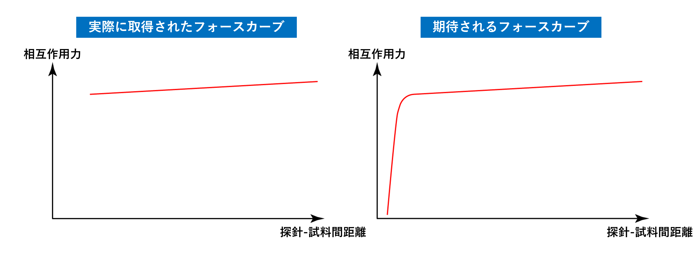
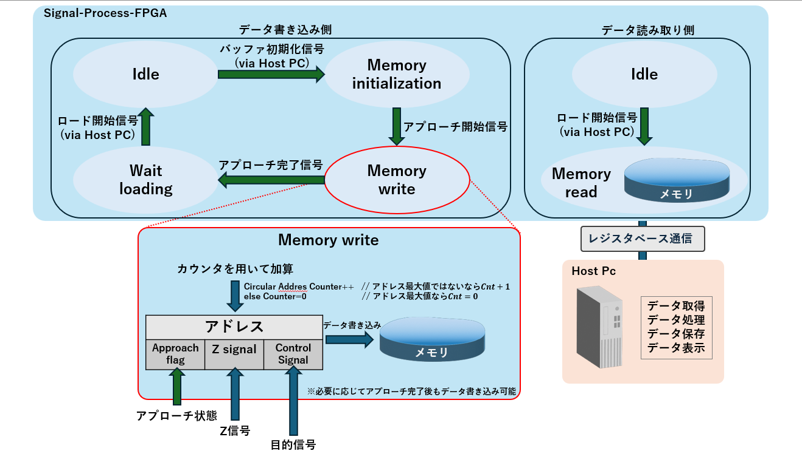
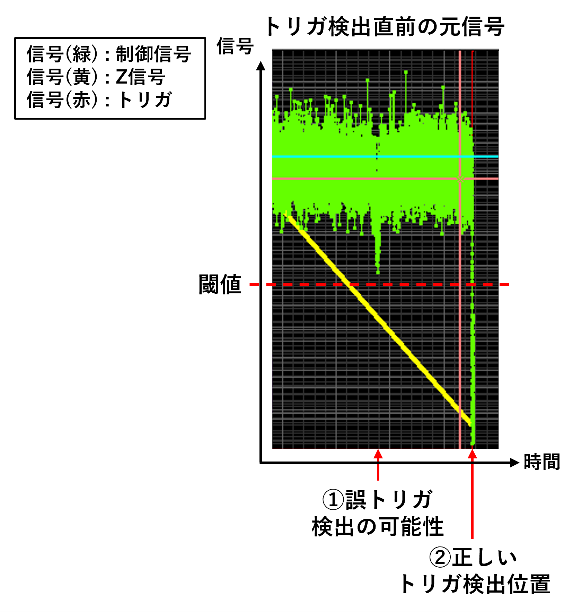
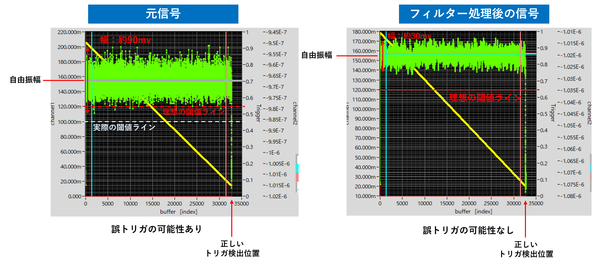
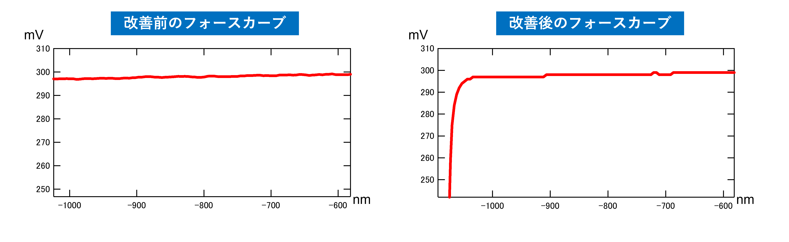

# 01_Engineering Challenge: フォースカーブ取得の安定化

本章では、フォースカーブ取得時に発生した誤トリガ問題に対し、  
FPGA内部信号の解析と信号処理回路の設計によって問題を解決した過程について説明します。

---

## 1. フォースカーブ取得の問題

フォースカーブは、探針を試料表面へアプローチさせながら取得される信号であり、  
探針と試料の相互作用力の変化を観測することで、表面の物理特性を評価するために用いられます。

その用途は様々であり、今回は長距離力成分を検出するために用います。

しかし実験を行ったところ、実際に取得されたフォースカーブは期待される形状と大きく異なっていました。  
本来は短距離相互作用力が現れるはずですが、取得された信号ではその変化が観測されませんでした。

これは、接触前の段階でトリガが検出され、計測が終了してしまっている可能性を示唆しています。

---

## 2. 信号解析のためのリングバッファの設計

この問題の原因を特定するためには、FPGA内部で処理されている信号挙動を詳細に観測する必要があります。  
しかし通常の計測では、トリガが発生する直前の信号を取得することは困難です。

そこで本研究では、信号履歴を保存するリングバッファ回路をFPGA上に設計しました。

リングバッファでは、信号を循環メモリに継続的に書き込み続けることで、  
トリガ発生前後の信号履歴を取得することができます。

書き込み処理はステートマシンによって制御し、

- アプローチ開始時に信号記録を開始
- アプローチ中の信号をメモリに保存
- トリガ発生前後の信号を保持
- Host PCへデータを転送

という構造としました。

---

## 3. 信号解析結果

リングバッファを用いて取得した信号を解析した結果、  
トリガ検出前の信号には大きなノイズ成分が含まれていることが分かりました。

このノイズが閾値を下回ることで、本来の接触位置よりも早い段階でトリガが発生してしまう可能性があります。

図に示すように、接触前のノイズスパイクによって誤トリガが発生するリスクが確認されました。

---

## 4. ノイズ低減のための信号処理

誤トリガの原因がノイズである可能性が高いことから、  
信号の高周波ノイズを低減するための移動平均フィルタを設計しました。

移動平均フィルタでは、一定数のサンプルの平均値を出力することで信号を平滑化し、  
ノイズによる瞬間的な振幅変動を抑制することができます。

移動平均フィルタは次式で表されます。

y[n] = (1/N) Σ_{k=0}^{N-1} x[n-k]

ここで x[n] は入力信号、y[n] はフィルタ出力、
N は平均するサンプル数を表します。この式に基づいて設計を行いました。

その結果、信号のノイズ振幅は

- 約90 mV → 約30 mV

まで低減され、閾値到達による誤トリガの可能性を抑制することができました。

---

## 5. 改善結果

信号処理回路を導入した結果、フォースカーブ取得の安定性が大きく改善しました。

改善前は、接触前にトリガが検出されてしまい、  
短距離相互作用力が観測されないフォースカーブとなっていました。

一方、改善後は正しい位置でトリガが検出されるようになり、  
期待されるフォースカーブを安定して取得できるようになりました。

---

## 6. まとめ

本問題の解決を通じて、

- FPGA内部信号を解析するためのリングバッファ回路を設計
- ノイズによる誤トリガの原因を特定
- 移動平均フィルタによる信号処理回路を実装

することで、フォースカーブ取得の安定化を実現しました。

この経験を通じて、計測システムにおける信号解析と信号処理の重要性を学びました。
また、実環境を想定した設計の重要性を学びました。
