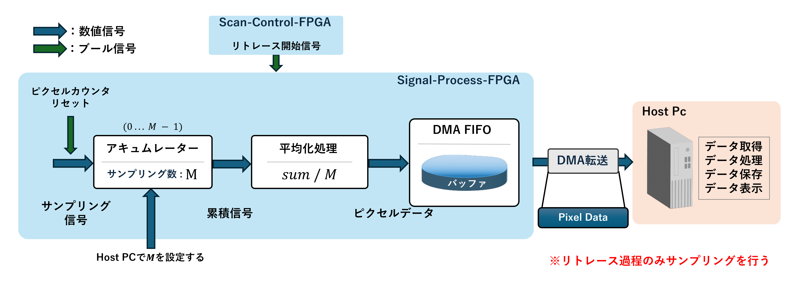
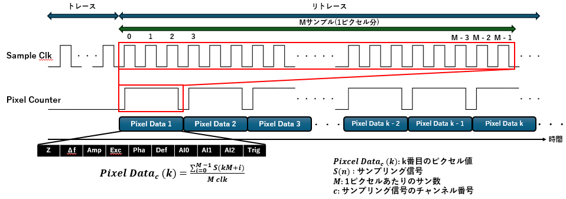

# 01_FPGA Sampling, Pixel Generation, and DMA Transfer

本章では、OL-EPM計測において取得したサンプリング信号からピクセルデータを生成し、Host PCへ転送するまでの処理について説明します。  
本システムでは、Signal-Process-FPGAにおいてサンプリング信号の平均化処理を行い、生成されたピクセルデータをDMAを用いてHost PCへ転送します。

また、サンプリング処理はトレース過程ではなく、リトレース過程においてのみ実行されます。

---

## 1. FPGAにおけるサンプリング処理とDMA転送の流れ

まず、サンプリング信号からピクセルデータが生成され、Host PCへ転送されるまでの処理の流れを図に示します。

Scan-Control-FPGAはリトレース開始信号を生成し、Signal-Process-FPGAに送信します。  
Signal-Process-FPGAでは、この信号をトリガとしてサンプリング処理を開始します。

サンプリング信号はまずアキュムレータに入力され、設定されたサンプリング数 \(M\) に達するまで累積されます。  
このとき、ピクセルカウンタによってサンプル数が管理され、\(0\) から \(M-1\) までカウントされます。

サンプル数が \(M\) に到達すると、累積された信号を用いて平均化処理を行い、1ピクセル分のデータを生成します。  
生成されたピクセルデータはDMA FIFOバッファへ書き込まれ、DMA転送によってHost PCへ送信されます。

Host PCでは、転送されたデータを取得し、データ処理・保存・表示などの処理を行います。

なお、サンプリング数 \(M\) はHost PCから設定され、Signal-Process-FPGAへ送信されます。

---

## 2. ピクセル平均化処理のタイミング図

次に、サンプリング信号からピクセルデータが生成されるタイミング関係を示します。

図に示すように、リトレース過程においてサンプリングクロックに同期してサンプリング信号が取得されます。  
ピクセルカウンタはサンプリングごとにインクリメントされ、\(0\) から \(M-1\) までカウントされます。

この \(M\) サンプルが1ピクセルを構成しており、\(M\) 個のサンプリング値がアキュムレータで累積されます。  
その後、累積値を \(M\) で除算することで平均化処理が行われ、1ピクセルの値が生成されます。

この処理を繰り返すことで、リトレースラインに沿った複数のピクセルデータが生成されます。

ピクセルデータ \(PixelData_c(k)\) は、次式によって表されます。

\[
PixelData_c(k) = \frac{\sum_{i=0}^{M-1} S_c(kM+i)}{M}
\]

ここで、

- \(PixelData_c(k)\)：k番目のピクセル値  
- \(S(n)\)：サンプリング信号  
- \(M\)：1ピクセルあたりのサンプル数  
- \(c\)：サンプリング信号のチャネル番号  

を表します。

このようにして生成されたピクセルデータはDMA FIFOへ格納され、Host PCへ高速転送されます。

---

## 3. まとめ

本章では、Signal-Process-FPGAにおけるサンプリング処理からピクセルデータ生成、
およびDMA転送によるHost PCへのデータ転送までの処理について説明しました。

本システムでは、サンプリング信号をMサンプル分累積し平均化することで
ピクセルデータを生成し、そのデータをDMA FIFOを介してHost PCへ転送する
構成を実装しました。

また、サンプリング信号の平均化処理のような連続的かつ高速な信号処理は
FPGAが得意とする処理であるため、これをFPGA側で実行しています。
一方で、データ取得後の処理・保存・表示などの柔軟な処理はHost PCで行う
構成としました。

このように、計測システム全体の処理負荷やデータ転送量のバランスを考慮し、
FPGAとHost PCの責務を分離することで、効率的な計測データ処理を実現しています。
