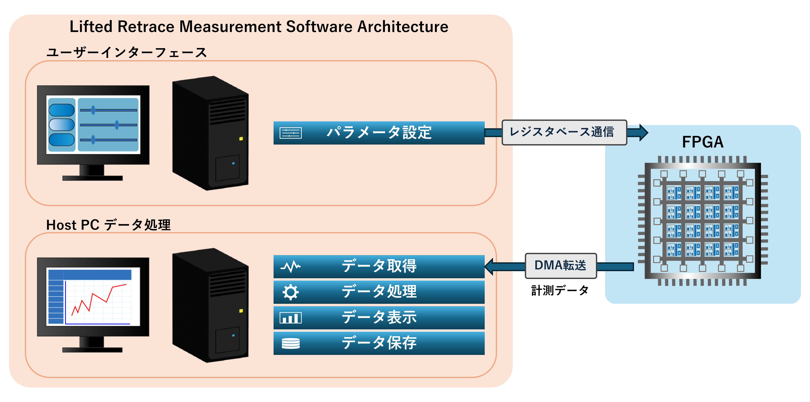

# 01_Software Architecture

## 1. 概要

リフテッドリトレース方式では、FPGA と Host PC が連携して計測を実行します。  
FPGA は探針制御や信号取得などのリアルタイム処理を担当し、Host PC はユーザー操作、計測条件の設定、データ取得、データ処理、表示および保存を担当します。

本研究では、Host PC 上で動作する計測ソフトウェア リフテッドリトレースモジュールを開発しました。本ソフトウェアはユーザーインターフェースとデータ処理機能を統合し、
FPGA と通信しながら計測を実行するための Host PC ソフトウェアです。

本章では、Host PC 側の計測ソフトウェアの全体構成について説明します。

---

## 2. ソフトウェア全体構成

Host PC 計測ソフトウェアのアーキテクチャを示します。

本ソフトウェアは大きく以下の2つの機能ブロックから構成されています。

- ユーザーインターフェース  
- Host PC データ処理機能  

ユーザーインターフェースでは、計測に必要なパラメータを設定します。設定されたパラメータは **レジスタベース通信**により FPGA に送信され、FPGA 内の制御回路に反映されます。

一方、FPGA で取得された計測データは **DMA転送**により Host PC に送信されます。Host PC 側では受信したデータに対して取得、処理、表示、保存を行います。

この構成により、ユーザー操作とデータ処理を分離しつつ、リアルタイムに計測結果を確認できるソフトウェア構造を実現しています。

---

## 3. ユーザーインターフェース

ユーザーインターフェースでは、計測条件の設定および計測操作を行います。  
ユーザーは、スキャンモード、探針の移動条件、信号検出条件などのパラメータを設定することができます。

設定されたパラメータはレジスタベース通信によって FPGA に送信され、FPGA 内の計測回路に反映されます。これにより、ユーザーが設定した条件に基づいて計測を実行することが可能になります。

ユーザーインターフェースの詳細については、次章 **02_UserInterface.md** で説明します。

---

## 4. Host PC データ処理

FPGA で取得された計測データは DMA 転送によって Host PC に送信されます。  
Host PC 側では受信したデータに対して以下の処理を行います。

- データ取得  
- データ処理  
- データ表示  
- データ保存  

データ取得では、FPGA から転送された計測データを受信します。  
データ処理では、取得したデータに対して必要な信号処理を行います。  
データ表示では、計測中のデータをリアルタイムで可視化します。  
データ保存では、取得した計測データをファイルとして保存します。

これらの処理を分離することで、計測中でも安定してデータ取得と表示を行える構造としています。

Host PC におけるデータ取得および処理の詳細については、**03_Host_Data_Acquisition_and_Processing.md** で説明します。
