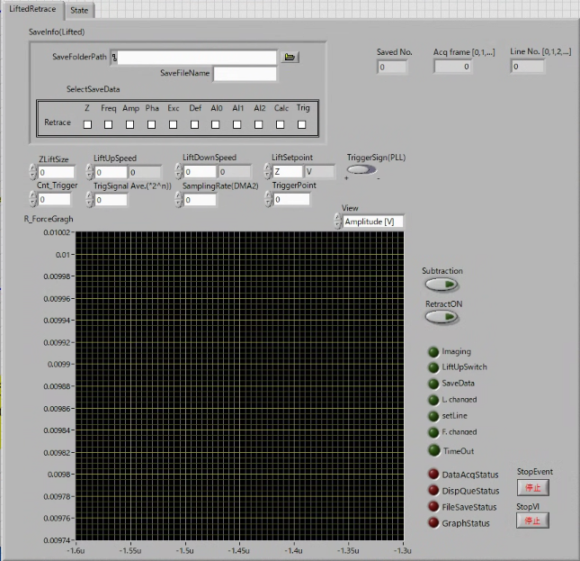
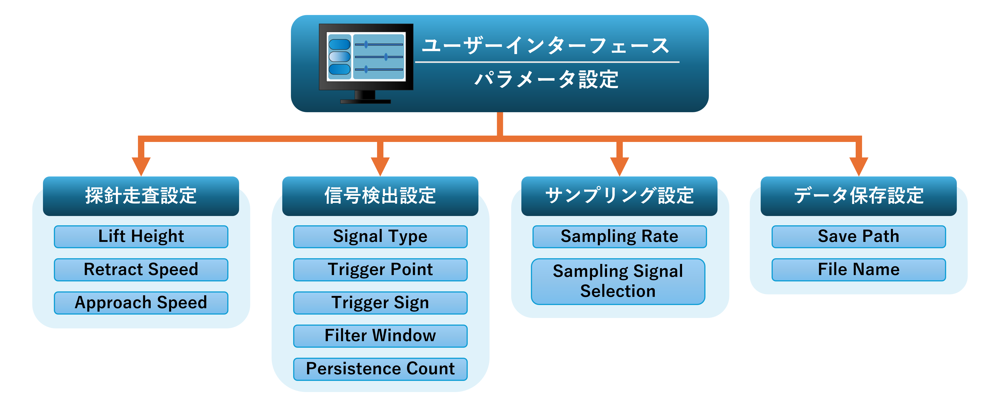

# 02 User Interface

## 1. 概要

Lifted Retrace 計測では、探針の走査条件や信号検出条件など、複数の計測パラメータを適切に設定する必要があります。そのため、本研究では Host PC 上にユーザーインターフェースを実装し、ユーザーが計測条件を設定できるようにしました。

ユーザーインターフェースでは、計測パラメータの設定、計測データの表示、計測状態の確認を行うことができます。設定されたパラメータは Host PC から FPGA に送信され、FPGA 内の計測回路に反映されます。

以下に本研究で開発したユーザーインターフェースを示します。

---

## 2. パラメータ構成

ユーザーインターフェースで設定可能なパラメータは、機能ごとに以下の4つのグループに分類されます。

- 探針走査設定  
- 信号検出設定  
- サンプリング設定  
- データ保存設定  

以下にユーザーインターフェースのパラメータ構成を示します。

---

## 3. 探針走査設定

探針走査設定では、Lifted Retrace 計測における探針の動作条件を設定します。

### Lift Height

リトレース走査時に探針を持ち上げる高さを設定します。  

### Retract Speed

探針を持ち上げる際の移動速度を設定します。  

### Approach Speed

探針を降ろす際の移動速度を設定します。

---

## 4. 信号検出設定

信号検出設定では、計測信号の検出条件を設定します。

### Signal Type

検出対象となる信号の種類を選択します。

### Trigger Point

信号検出の判定に使用する閾値を設定します。

### Trigger Sign

信号が閾値を上回る場合または下回る場合のどちらを検出条件とするかを設定します。

### Filter Window

信号の移動平均処理に使用する窓長を設定します。  
移動平均を行うことで、ノイズの影響を低減します。

### Persistence Count

信号検出の安定性を確保するために、条件を連続して満たす必要のある回数を設定します。

---

## 5. サンプリング設定

サンプリング設定では、計測データの取得条件を設定します。

### Sampling Rate

計測データのサンプリング周期を設定します。

### Sampling Signal Selection

サンプリング対象となる信号を選択します。

---

## 6. データ保存設定

データ保存設定では、計測データの保存条件を設定します。

### Save Path

計測データを保存するディレクトリを指定します。

### File Name

保存するファイル名を指定します。

---

## 7. まとめ

本章では、Lifted Retrace 計測ソフトウェアのユーザーインターフェースについて説明しました。ユーザーインターフェースでは、探針走査条件、信号検出条件、サンプリング条件、データ保存条件を設定することができます。

これらのパラメータをユーザーが設定することで、計測条件を柔軟に調整しながら Lifted Retrace 計測を実行できるようにしています。
