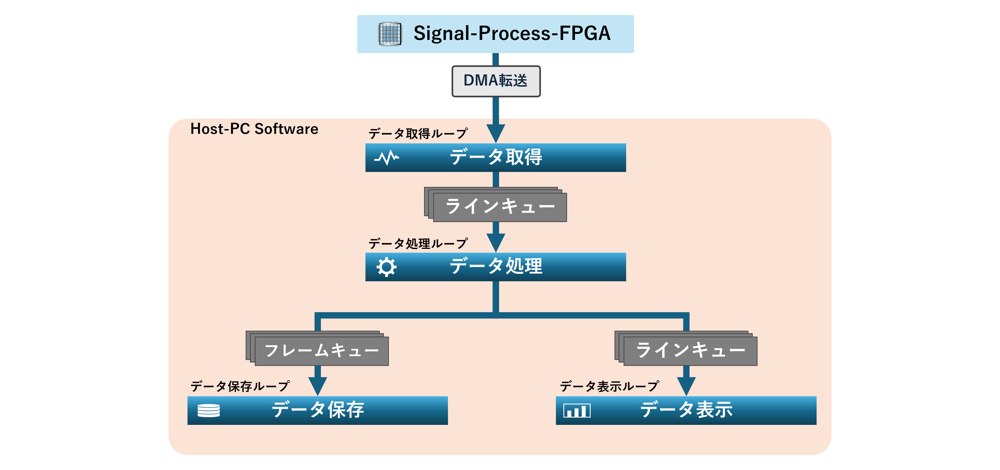
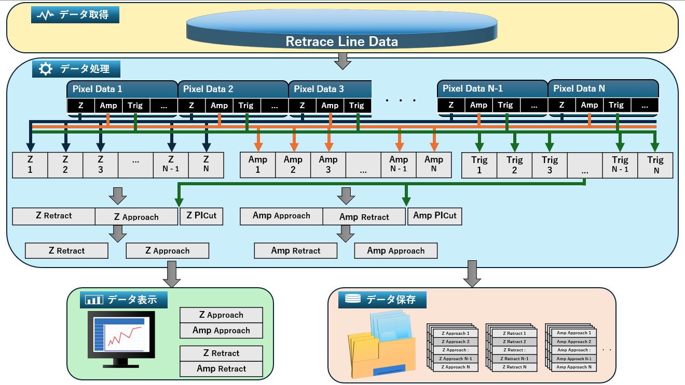

# 03_Host Data Acquisition and Processing

## 1. 概要

Host PC ソフトウェアでは、FPGA から DMA 転送された計測データを取得し、データ処理、表示、保存を行います。

計測中でも安定したデータ処理を実現するため、本ソフトウェアではキューを用いた Producer–Consumer 構造を採用しています。  
この構造により、データ取得、データ処理、データ表示、データ保存をそれぞれ独立したループとして実行しています。

また、表示処理はライン単位、保存処理はフレーム単位でデータを扱うことで、リアルタイム表示と効率的なデータ保存を両立しています。

以下に Host PC ソフトウェアにおけるデータ処理構造を示します。

---

## 2. データ取得ループ

データ取得ループでは、FPGA から DMA 転送された計測データを受信します。  
このループはステートマシンと連携し、計測シーケンスに応じてデータ取得タイミングを制御しています。

取得されたデータは ライン単位のデータ（Line Data）として整理され、ラインキューを介してデータ処理ループへ送られます。

---

## 3. データ処理ループ

データ処理ループでは、ラインキューから取得したデータを処理し、表示および保存に利用できる形式へ変換します。

以下にデータ処理ループにおける処理フローを示します。

受信したラインデータは、複数のサンプリング信号（Z、Amplitude、Trigger など）を含む **Pixel Data** の配列として構成されています。

データ処理ループでは以下の処理を行います。

### サンプリング信号の分離

各 Pixel Data に含まれる信号を分離し、  
Z、Amplitude、Trigger などの信号ごとにラインデータを再構成します。

### リトレースデータの分離

Trigger 信号を用いて、リトレース走査中のアプローチ完了以降のデータをカットします。  
次に、Z信号が最も大きいインデックスを配列から抽出し、その位置を境界としてデータを

- Approach 区間
- Retract 区間

に分離します。

### 表示用データの生成

表示処理ではリアルタイム性を重視するため、ライン単位のデータをラインキューへ送信します。

### 保存用データの生成

保存処理ではフレーム単位のデータを扱うため、  
ラインデータをフレーム単位でまとめ、フレームキューへ送信します。

---

## 4. データ表示ループ

データ表示ループでは、ラインキューから取得したデータをグラフとして表示します。

ユーザーインターフェースで選択されたサンプリング信号を用いて、
Z Approach 信号と対応する信号（例：Amplitude など）を組み合わせ、
フォースカーブを表示します。

表示処理はライン単位で行うことで、計測中でもリアルタイムに
フォースカーブを確認できるようにしています。

---

## 5. データ保存ループ

データ保存ループでは、フレームキューから取得したデータを **TDMS ファイル形式**で保存します。

保存処理を独立したループとして実装することで、ディスクアクセスによる処理遅延が計測処理へ影響を与えないようにしています。

また、フレーム単位で保存することで、ファイル構造を整理し、後処理や解析を行いやすいデータ形式としています。

---

## 6. まとめ

本章では、Host PC におけるデータ取得およびデータ処理機構について説明しました。

本ソフトウェアでは Producer–Consumer 構造を採用し、データ取得、処理、表示、保存を独立したループとして実装しています。  
さらに、表示処理はライン単位、保存処理はフレーム単位でデータを扱うことで、リアルタイム表示と効率的なデータ保存を両立しています。

この構造により、計測中でも安定してデータ処理を行うことが可能となっています。
