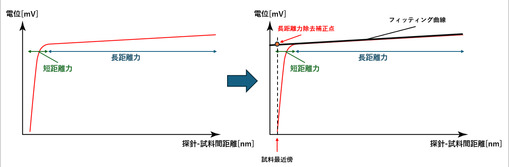
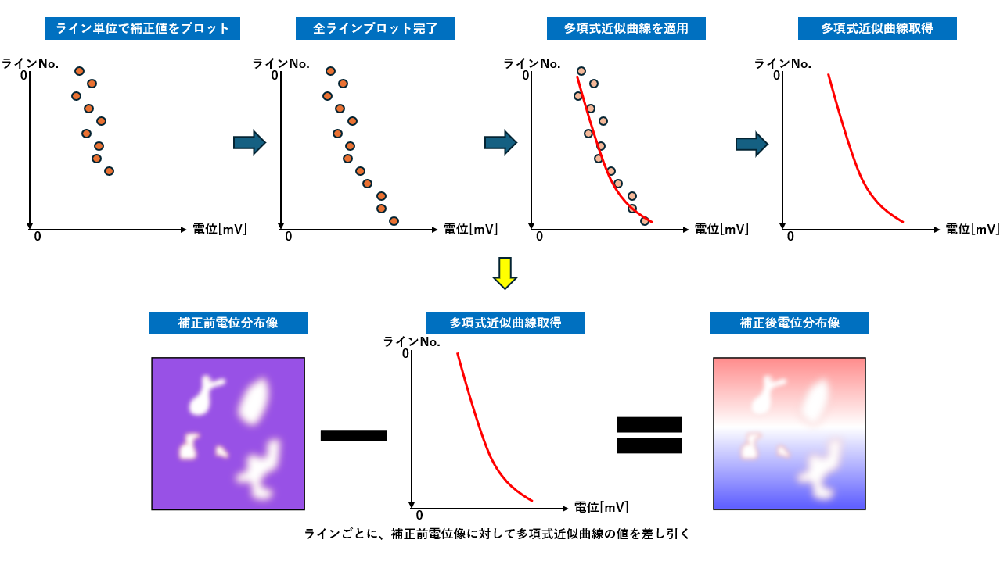

# 01_Long_Range_Force_Removal_Correction

## 1. 背景

OL-EPM において取得される電位信号には、試料表面の局所的な電位だけでなく、探針と試料間の長距離力に起因する成分が含まれます。  
この長距離力成分は電位像全体に緩やかな傾きとして現れ、正確な電位分布の取得を妨げる要因となります。

長距離力は探針–試料間距離に対して線形的に変位することが知られています。  
そのため本研究では、長距離力成分に対して線形フィッティングを行い、試料最近傍における長距離力を推定することで補正点を求めました。

---

## 2. 長距離力除去補正点の推定

フォースカーブから長距離力成分を推定し、補正点を決定します。

- 短距離力：試料近傍で急激に変化する成分  
- 長距離力：距離に対して緩やかに変化する成分  

長距離力領域に対して線形フィッティングを行い、  
試料最近傍における値を長距離力除去補正点とします。

---

## 3. 長距離力除去補正の処理フロー

本研究では、リフテッドリトレース方式によりライン単位でフォースカーブを取得しています。  
そのため、各ラインについて補正点を求め、全ラインに対してプロットを行います。

全ラインの補正点が取得できた後、補正点群に対して多項式近似曲線を適用し、長距離力の空間的な変化をモデル化します。

最後に、この多項式近似曲線を補正値として補正前電位像からラインごとに差し引くことで、長距離力成分を除去した電位像を取得します。

---

## 5. まとめ

多項式近似曲線を用いた長距離力除去補正機能を実装しました。  
本手法により、電位像に含まれる長距離力由来の傾き成分を補正する処理が可能になりました。  
現在は、この補正手法の有効性について評価・検証を進めています。
