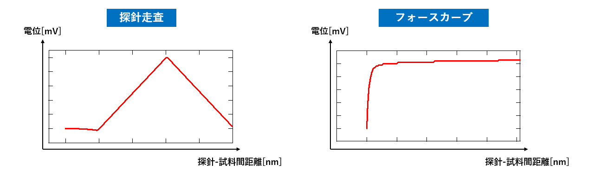
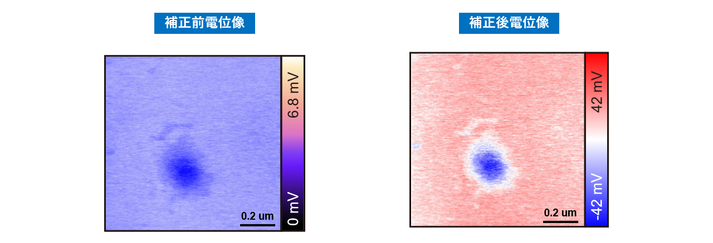

# 07 Validation

本章では、開発した走査回路およびノイズ補正機能が正しく動作しているかを確認するための評価結果について説明します。  
本評価では、探針走査、フォースカーブ取得、長距離力除去補正の3点に着目して検証を行いました。

---

## 1. 探針走査とフォースカーブ取得の確認

開発した走査回路により、探針が試料表面を走査しながら電位信号を取得できることを確認しました。 

また、リトレース過程においてフォースカーブを取得できることを確認しました。

左図は探針走査の模式的な信号例を示しています。  
右図は取得されたフォースカーブの例であり、探針と試料間距離の変化に伴う信号変化が確認できます。  
これにより、設計した走査回路および信号取得機構が正しく機能していることを確認しました。

また、探針走査の動作確認として、探針の持ち上げ量および降下量が
FPGAクロックに基づく制御ステップと一致していることを確認しています。

---

## 2. 長距離力除去補正の検証

取得したフォースカーブを用いて、長距離力による影響を除去する補正処理を行いました。  
補正処理では、フォースカーブから長距離力成分を推定し、その影響を各走査ラインの電位データから除去します。

補正前後の電位像を以下に示します。

左図は補正前の電位像です。補正前の画像では電位の極性が明確ではなく、
試料表面の電位分布を正しく判定することが困難でした。

右図は長距離力除去補正を適用した後の電位像です。
補正処理により電位の極性が明確になり、試料表面の電位分布を
判定できることを確認しました。電位の極性を判定できることは、
腐食などの電位変化を議論する上で重要であり、本手法はその点で価値があると考えられます。

一方で、本測定では時間変動する長距離力の影響によるライン方向のむらは
顕著には観測されませんでした。そのため、長距離力による
むらの低減に対する本手法の有効性については、
今後さらに検証を進める予定です。

---

## 3. 評価結果

本評価により、以下の点を確認しました。

- 開発した走査回路により探針走査が正常に動作すること
- フォースカーブを取得できること
- フォースカーブを用いた長距離力除去補正が可能であること
- 補正により電位像の安定性が向上すること

以上の結果から、本研究で開発した計測および補正機構により、
電位像の精度向上が期待できると考えられます。

## 4. さいごに

本研究では、課題の整理から仕様設計、FPGA回路設計、データ取得、信号処理、評価までを一貫して行いました。  
これらの経験を通じて、計測システム全体を俯瞰しながら課題を解決する開発プロセスを経験しました。

今後も、ハードウェアとソフトウェアの両面から計測システムを設計し、
データの取得から解析までを含めたシステム開発に取り組んでいきたいと考えています。
